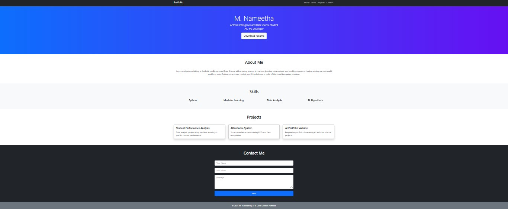
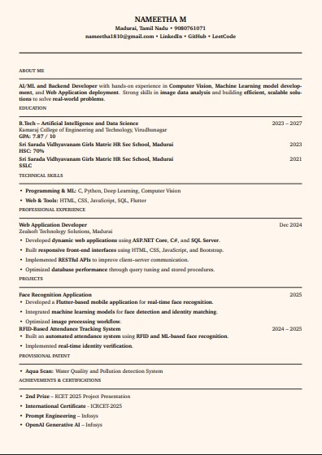

# Full_Stack_EX_1 – Personal Portfolio Website

This repository contains a simple and responsive **Personal Portfolio Website** developed using HTML and CSS.

The website showcases personal details, skills, projects, and contact information in a clean and structured layout.

---

## 📌 Project Overview

This is a single-page portfolio website designed to present:

- 👤 Personal Introduction  
- 🎓 Educational Background  
- 💡 Skills  
- 💻 Projects  
- 📞 Contact Information  
- 📄 Resume Preview  

---

## 🖼️ Project Screenshots

### 🔹 Portfolio Website



---

### 🔹 Resume Preview



---

## 🛠️ Technologies Used

- HTML5  
- CSS3  
- Responsive Design  

---


---

## 🚀 How to Run the Project

1. Clone the repository:

   ```bash
   git clone https://github.com/Namee2518/Full_Stack_EX_1.git


